# EGVSR-PyTorch
[GitHub](https://github.com/Thmen/EGVSR) **|** [Gitee码云](https://gitee.com/Digital-Design/EGVSR)

<p align = "center">
    <br>VSR x4: EGVSR; Upscale x4: Bicubic Interpolation
</p>


## Contents
- [EGVSR-PyTorch](#egvsr-pytorch)
  - [Contents](#contents)
  - [Introduction](#introduction)
  - [Features](#features)
  - [Dependencies](#dependencies)
  - [Datasets](#datasets)
    - [A. Training Dataset](#a-training-dataset)
    - [B. Testing Datasets](#b-testing-datasets)
  - [Benchmarks](#benchmarks)
    - [A. Test on Vid4 Dataset](#a-test-on-vid4-dataset)
    - [B. Test on Tos3 Dataset](#b-test-on-tos3-dataset)
    - [C. Test on Gvt72 Dataset](#c-test-on-gvt72-dataset)
    - [D. Optical-Flow based Motion Compensation](#d-optical-flow-based-motion-compensation)
    - [E. Comprehensive Performance](#e-comprehensive-performance)
  - [License & Citations](#license--citations)
  - [Acknowledgements](#acknowledgements)


## Introduction
This is a PyTorch implementation of **EGVSR**: **E**fficcient & **G**eneral Video Super-Resolution (**VSR**), using subpixel convolution to optimize the inference speed of TecoGAN VSR model. Please refer to the official implementation [ESPCN](https://github.com/leftthomas/ESPCN) and [TecoGAN](https://github.com/thunil/TecoGAN) for more information.


## Features
- **Unified Framework**: This repo provides a unified framework for various state-of-the-art DL-based VSR methods, such as VESPCN, SOFVSR, FRVSR, TecoGAN and our EGVSR.
- **Multiple Test Datasets**: This repo offers three types of video datasets for testing, i.e., standard test dataset -- Vid4, Tos3 used in TecoGAN and our new dataset -- Gvt72 (selected from [Vimeo](https://vimeo.com) site and including more scenes).
- **Better Performance**: This repo provides model with faster inferencing speed yet better overall performance than prior methods. See more details in [Benchmarks](#benchmarks) section.


## Dependencies
- Ubuntu >= 16.04
- NVIDIA GPU + CUDA & CUDNN
- Python 3
- PyTorch >= 1.0.0
- Python packages: numpy, matplotlib, opencv-python, pyyaml, lmdb ([requirements.txt](requirements.txt) & [req.txt](req.txt))
- (Optional) Matlab >= R2016b


## Datasets
### A. Training Dataset
Download the official training dataset based on the instructions in [TecoGAN-TensorFlow](https://github.com/thunil/TecoGAN), rename to `VimeoTecoGAN` and then place under `./data`.

### B. Testing Datasets
* Vid4 -- Four video sequences: city, calendar, foliage and walk;
* Tos3 -- Three video sequences: bridge, face and room;
* Gvt72 -- General VSR Test Dataset: 72 video sequences (including natural scenery, culture scenery, streetscape scene, life record, sports photography, etc, as shown below)

<p align = "center">
    
</p>

You can get them at :arrow_double_down: [百度网盘](https://pan.baidu.com/s/1lKyLJ5u6lrrXejyljao0Mw) (提取码:8tqc) and put them into :file_folder: [Datasets](data).
The following shows the structure of the above three datasets.
```tex
data
  ├─ Vid4
    ├─ GT                # Ground-Truth (GT) video sequences
      └─ calendar
        ├─ 0001.png
        └─ ...
    ├─ Gaussian4xLR      # Low Resolution (LR) video sequences in gaussian degradation and x4 down-sampling
      └─ calendar
        ├─ 0001.png
        └─ ...
  └─ ToS3
    ├─ GT
    └─ Gaussian4xLR
  └─ Gvt72
    ├─ GT
    └─ Gaussian4xLR
```


## Benchmarks
**Experimental Environment**
|        | Version            | Info.      |
| ------ |:------------------ | :--------- |
| System | Ubuntu 18.04.5 LTS | X86_64     |
| CPU    | Intel i9-9900      | 3.10GHz    |
| GPU    | Nvidia RTX 2080Ti  | 11GB GDDR6 |
| Memory | DDR4 2666          | 32GB×2    |

### A. Test on Vid4 Dataset
<p align = "center">
    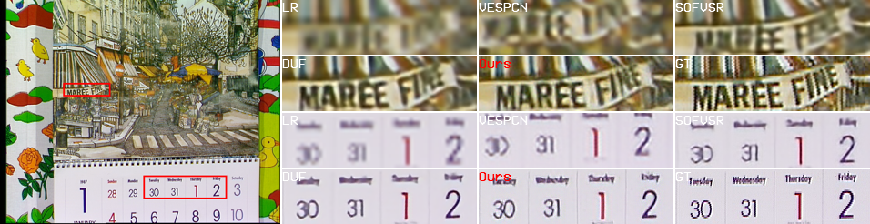
    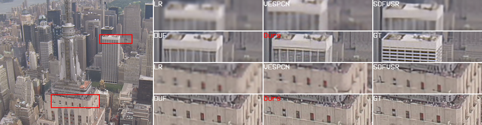
    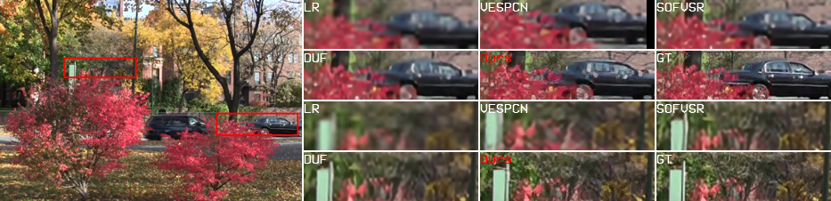
    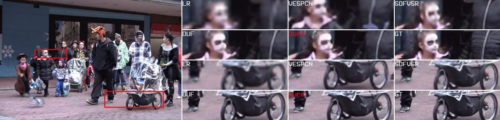
    <br> 1.LR 2.VESPCN 3.SOFVSR 4.DUF 5.Ours:EGVSR 6.GT
    
    <br>Objective metrics for visual quality evaluation[1]
</p>

### B. Test on Tos3 Dataset
<p align = "center">
    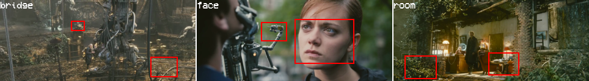
    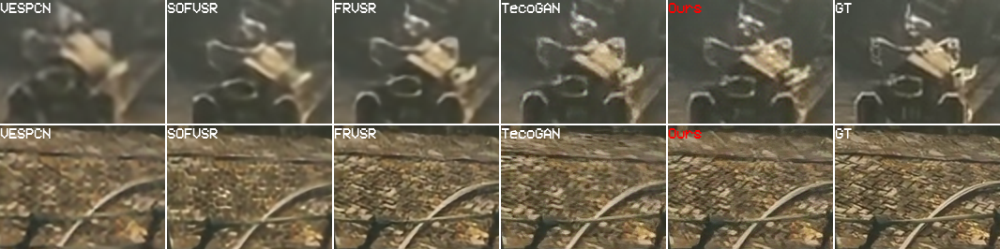
    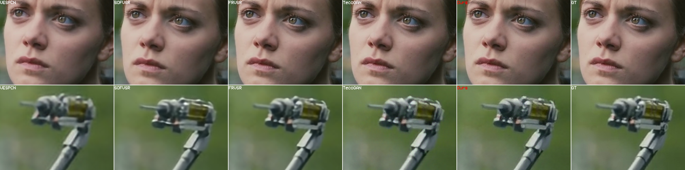
    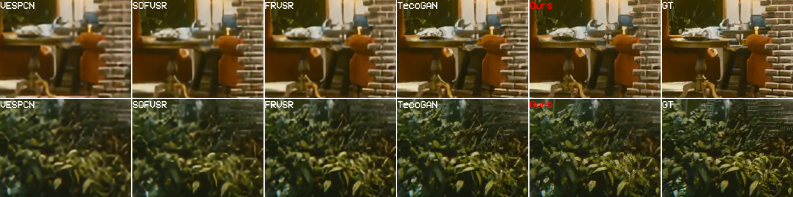
    <br> 1.VESPCN 2.SOFVSR 3. FRVSR 4.TecoGAN 5.Ours:EGVSR 6.GT
    
</p>
    
### C. Test on Gvt72 Dataset
<p align = "center">
    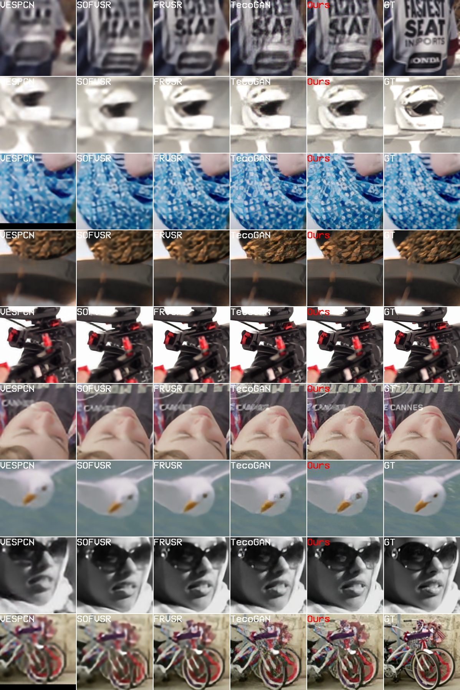
    <br> 1.LR 2.VESPCN 3.SOFVSR 4.DUF 5.Ours:EGVSR 6.GT    
    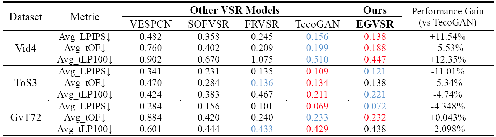
    <br> Objective metrics for visual quality and temporal coherence evaluation[1]
</p>

### D. Optical-Flow based Motion Compensation

Please refer to [FLOW_walk](results/seq_flow_walk.png), [FLOW_foliage](results/seq_flow_foliage.png) and [FLOW_city](results/seq_flow_city.png).

### E. Comprehensive Performance

<!-- <script type="text/javascript" src="http://cdn.mathjax.org/mathjax/latest/MathJax.js?config=default"></script>

$$M_{nor}=(M-M_{min})/(M_{max}-M_{min})) \\
Score=1-(\lambda_{1}LPIPS_{nor}+\lambda_{2}tOF{nor}+\lambda_{3}tLP100_{nor})[2]$$ -->


<p align = "center">
  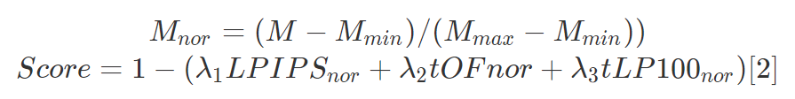
  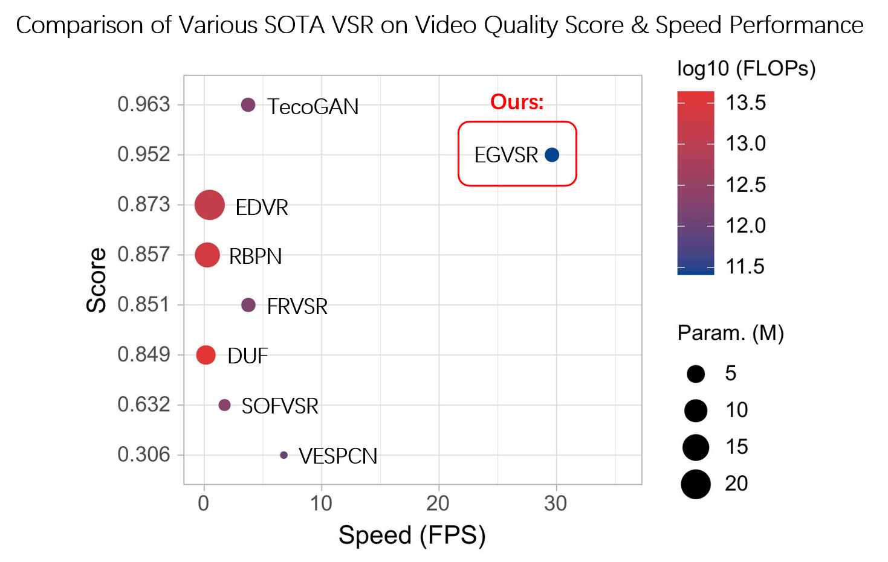
  <br> Comparison of various SOTA VSR model on video quality score and speed performance[3]
</p>


> <sup>[1]</sup> :arrow_down::smaller value for better performance, :arrow_up:: on the contrary; Red: stands for Top1, Blue: Top2.
> <sup>[2]</sup> The calculation formula of video quality score considering both spatial and temporal domain, using lambda1=lambda2=lambda3=1/3.
> <sup>[3]</sup> FLOPs & speed are computed on RGB with resolution 960x540 to 3840x2160 (4K) on NVIDIA GeForce GTX 2080Ti GPU.


## License & Citations
This EGVSR project is released under the MIT license. See more details in [LICENSE](LICENSE).
The provided implementation is strictly for academic purposes only. If EGVSR helps your research or work, please consider citing EGVSR. The following is a BibTeX reference:

``` latex
@misc{thmen2021egvsr,
  author =       {Yanpeng Cao and Chengcheng Wang and Feng Yu and Yongming Tang},
  title =        {EGVSR},
  howpublished = {\url{https://github.com/Thmen/EGVSR}},
  year =         {2021}
}
```

> Yanpeng Cao, Chengcheng Wang, Feng Yu and Yongming Tang. EGVSR. https://github.com/Thmen/EGVSR, 2021.


## Acknowledgements
This code is built on the following projects. We thank the authors for sharing their codes.
1. [ESPCN](https://github.com/leftthomas/ESPCN)
2. [BasicSR](https://github.com/xinntao/BasicSR)
3. [VideoSuperResolution](https://github.com/LoSealL/VideoSuperResolution)
4. [TecoGAN-PyTorch](https://github.com/skycrapers/TecoGAN-PyTorch)
