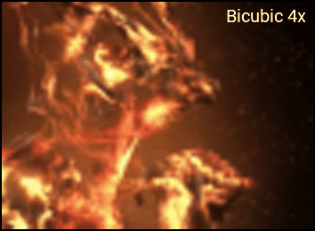
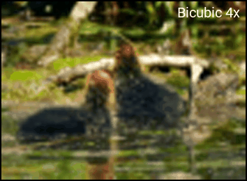
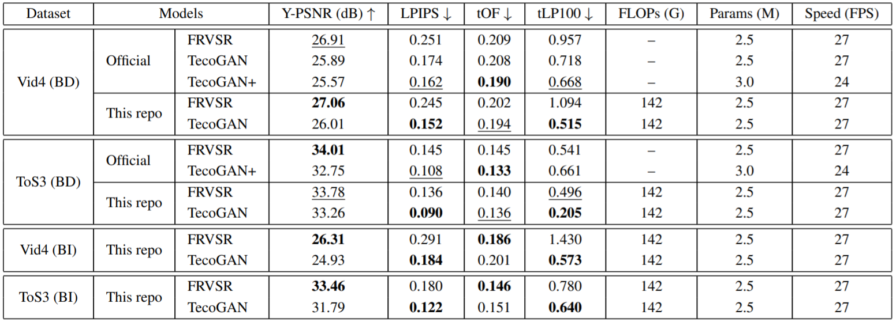

# TecoGAN-PyTorch

### Introduction
This is a PyTorch reimplementation of **TecoGAN**: **Te**mporally **Co**herent **GAN** for Video Super-Resolution (VSR). Please refer to the official TensorFlow implementation [TecoGAN-TensorFlow](https://github.com/thunil/TecoGAN) for more information.

<p align = "center">
    
    
</p>

<p align = "center">
    
    
</p>


### Features
- **Better Performance**: This repo provides model with smaller size yet better performance than the official repo. See our [Benchmark](https://github.com/skycrapers/TecoGAN-PyTorch#benchmark) on Vid4 and ToS3 datasets.
- **Multiple Degradations**: This repo supports two types of degradation, i.e., BI & BD. Please refer to [this wiki]() for more details about degradation types.
- **Unified Framework**: This repo provides a unified framework for distortion-based and perception-based VSR methods.

### Contents
1. [Dependencies](#dependencies)
1. [Test](#test)
1. [Training](#training)
1. [Benchmark](#benchmark)
1. [License & Citation](#license--citation)
1. [Acknowledgements](#acknowledgements)


## Dependencies
- Ubuntu >= 16.04
- NVIDIA GPU + CUDA
- Python 3
- PyTorch >= 1.0.0
- Python packages: numpy, matplotlib, opencv-python, pyyaml, lmdb
- (Optional) Matlab >= R2016b


## Test

**Note:** We apply different models according to the degradation type of the data. The following steps are for 4x upsampling in BD degradation. You can switch to BI degradation by replacing all `BD` to `BI` below.

1. Download the official Vid4 and ToS3 datasets.
```bash
bash ./scripts/download/download_datasets.sh BD 
```
> If the above command doesn't work, you can manually download these datasets from Google Drive, and then unzip them under `./data`.
> * Vid4 Dataset [[Ground-Truth Data](https://drive.google.com/file/d/1T8TuyyOxEUfXzCanH5kvNH2iA8nI06Wj/view?usp=sharing)] [[Low Resolution Data (BD)](https://drive.google.com/file/d/1-5NFW6fEPUczmRqKHtBVyhn2Wge6j3ma/view?usp=sharing)] [[Low Resolution Data (BI)](https://drive.google.com/file/d/1Kg0VBgk1r9I1c4f5ZVZ4sbfqtVRYub91/view?usp=sharing)]
> * ToS3 Dataset [[Ground-Truth Data](https://drive.google.com/file/d/1XoR_NVBR-LbZOA8fXh7d4oPV0M8fRi8a/view?usp=sharing)] [[Low Resolution Data (BD)](https://drive.google.com/file/d/1rDCe61kR-OykLyCo2Ornd2YgPnul2ffM/view?usp=sharing)] [[Low Resolution Data (BI)](https://drive.google.com/file/d/1FNuC0jajEjH9ycqDkH4cZQ3_eUqjxzzf/view?usp=sharing)] 

The dataset structure is shown as below.
```tex
data
  ├─ Vid4
    ├─ GT                # Ground-Truth (GT) video sequences
      └─ calendar
        ├─ 0001.png
        └─ ...
    ├─ Gaussian4xLR      # Low Resolution (LR) video sequences in BD degradation
      └─ calendar
        ├─ 0001.png
        └─ ...
    └─ Bicubic4xLR       # Low Resolution (LR) video sequences in BI degradation
      └─ calendar
        ├─ 0001.png
        └─ ...
  └─ ToS3
    ├─ GT
    ├─ Gaussian4xLR
    └─ Bicubic4xLR
```

2. Download our pre-trained TecoGAN model. Note that this model is trained with lesser training data compared with the official one, since we can only retrieve 212 out of 308 videos from the official training dataset.
```bash
bash ./scripts/download/download_models.sh BD TecoGAN
```
> Again, you can download the model from [[BD degradation](https://drive.google.com/file/d/13FPxKE6q7tuRrfhTE7GB040jBeURBj58/view?usp=sharing)] or [[BI degradation](https://drive.google.com/file/d/1ie1F7wJcO4mhNWK8nPX7F0LgOoPzCwEu/view?usp=sharing)], and put it under `./pretrained_models`.

3. Super-resolute the LR videos with TecoGAN. The results will be saved at `./results`.
```bash
bash ./test.sh BD TecoGAN
```

4. Evaluate SR results using the official metrics. These codes are borrowed from [TecoGAN-TensorFlow](https://github.com/thunil/TecoGAN), with minor modifications to adapt to BI mode.
```bash
python ./codes/official_metrics/evaluate.py --model TecoGAN_BD_iter500000
```

5. Check out model statistics (FLOPs, parameters and running speed). You can modify the last argument to specify the video size.
```bash
bash ./profile.sh BD TecoGAN 3x134x320
```

## Training
1. Download the official training dataset based on the instructions in [TecoGAN-TensorFlow](https://github.com/thunil/TecoGAN), rename to `VimeoTecoGAN` and then place under `./data`.

2. Generate LMDB for GT data to accelerate IO. The LR counterpart will then be generated on the fly during training.
```bash
python ./scripts/create_lmdb.py --dataset VimeoTecoGAN --data_type GT
```

The following shows the dataset structure after completing the above two steps.
```tex
data
  ├─ VimeoTecoGAN          # Original (raw) dataset
    ├─ scene_2000
      ├─ col_high_0000.png
      ├─ col_high_0001.png
      └─ ...
    ├─ scene_2001
      ├─ col_high_0000.png
      ├─ col_high_0001.png
      └─ ...
    └─ ...
  └─ VimeoTecoGAN.lmdb     # LMDB dataset
    ├─ data.mdb
    ├─ lock.mdb
    └─ meta_info.pkl       # each key has format: [vid]_[total_frame]x[h]x[w]_[i-th_frame]
```

3. **(Optional, this step is needed only for BI degradation)** Manually generate the LR sequences with Matlab's imresize function, and then create LMDB for them.
```bash
# Generate the raw LR video sequences. Results will be saved at ./data/Bicubic4xLR
matlab -nodesktop -nosplash -r "cd ./scripts; generate_lr_BI"

# Create LMDB for the raw LR video sequences
python ./scripts/create_lmdb.py --dataset VimeoTecoGAN --data_type Bicubic4xLR
```

4. Train a FRVSR model first. FRVSR has the same generator as TecoGAN, but without GAN training. When the training is finished, copy and rename the last checkpoint weight from `./experiments_BD/FRVSR/001/train/ckpt/G_iter400000.pth` to `./pretrained_models/FRVSR_BD_iter400000.pth`. This step offers a better initialization for the TecoGAN training.
```bash
bash ./train.sh BD FRVSR
```
> You can download and use our pre-trained FRVSR model [[BD degradation](https://drive.google.com/file/d/11kPVS04a3B3k0SD-mKEpY_Q8WL7KrTIA/view?usp=sharing)] [[BI degradation](https://drive.google.com/file/d/1wejMAFwIBde_7sz-H7zwlOCbCvjt3G9L/view?usp=sharing)] without training from scratch.
>```bash
>bash ./scripts/download/download_models.sh BD FRVSR
>```

5. Train a TecoGAN model. By default, the training is conducted in the background and the output info will be logged at `./experiments_BD/TecoGAN/001/train/train.log`.
```bash
bash ./train.sh BD TecoGAN
```

6. To monitor the training process and visualize the validation performance, run the following script.
```bash
 python ./scripts/monitor_training.py --degradation BD --model TecoGAN --dataset Vid4
```
> Note that the validation results are NOT the same as the test results mentioned above, because we use a different implementation of the metrics. The differences are caused by croping policy, LPIPS version and some other issues.


## Benchmark

<p align = "center">
    
</p>

> <sup>[1]</sup> FLOPs & speed are computed on RGB sequence with resolution 134\*320 on NVIDIA GeForce GTX 1080Ti GPU. \
> <sup>[2]</sup> Both FRVSR & TecoGAN use 10 residual blocks, while TecoGAN+ has 16 residual blocks.


## License & Citation
The provided implementation is strictly for academic purposes only. If you use this code for your research, please cite the following paper.
```tex
@article{tecogan2020,
  title={Learning temporal coherence via self-supervision for GAN-based video generation},
  author={Chu, Mengyu and Xie, You and Mayer, Jonas and Leal-Taix{\'e}, Laura and Thuerey, Nils},
  journal={ACM Transactions on Graphics (TOG)},
  volume={39},
  number={4},
  pages={75--1},
  year={2020},
  publisher={ACM New York, NY, USA}
}
```


## Acknowledgements
This code is built on [TecoGAN-TensorFlow](https://github.com/thunil/TecoGAN), [BasicSR](https://github.com/xinntao/BasicSR) and [LPIPS](https://github.com/richzhang/PerceptualSimilarity). We thank the authors for sharing their codes.

If you have any questions, feel free to email `jn.deng@foxmail.com`
